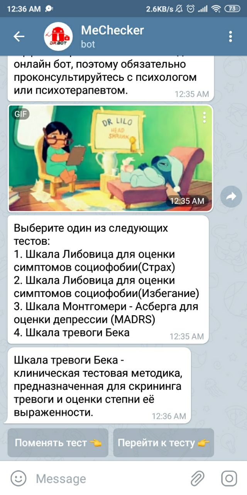

# Chatbot - MeChecker📱

## Table of Contents
- [Description](#description)
- [Preview](#preview)
- [How To Use](#how-to-use)
- [Author info](#author-info)

## Description
I developed this application in collaboration with TLMS04. The app is a telegram bot and it's one of our college projects.

### What this app can do?💥
- User can pass the test which will determine how he is feeling right now
- User can pick a test he'd like to pass
- Every test has its own questions and answers
- Results and recommendation send to user when he is finished with the test
- Tests, answers, questions, grades, recommendations, user's data are stored in DB

### What do I like about this project?🤟
- I worked in a team with my mate TLMS04 and it was a great experience, because we were helping each other,
  we both cared about this application and wanted it becomes more useful and unique. Also, we tried our
  best to think through architecture and write clean maintainable code
- Bot has a gif for every question and every recommendation so the process of passing the test became very funny. Our purpose was to make it fun, but at the same time user will get realistic results
- It creates wonderful charts, actually I adore them
- App can really help people to track their emotional level and it's dynamic

### What could be better?🤭
- All information about tests, questions, etc has to be in DB. Therefore, there has to be
  something like commands for admin so he could add more test, recommendation, etc,
  but we didn't implement it due to the deadline
- The charts have got on my nerves when I was implementing them
- The recommendations are static and get pretty annoying after a certain time so it would be great if
  there were some machine learning for the analysis of user's results, but none of us had experience in that area

## Preview
|                     Welcome message|      Pick test menu                 | 
| :-----------------------------------: | :-----------------------------------: |
|  | 
|                      Description of picked test|      First question                | 
|  | |
|                      Second question|      One more question                | 
|  | |
|                      Last question|      Results of the test                | 
|  | |
|                      Sent charts|      Sent charts                | 
|  | |

### 
This chart represents the results of the current test
 
### 
This chart represents all results of passed test
 
### 
This chart represents all results of all tests
 

## How To Use
Python 3.7+ must be installed on your PC.
MySql server 8.20 must be installed on your PC.
Then clone this project. Unfortunately, you can't run the bot on your local PC, because you require a token for the bot that is hidden in
config.py and we can share it in case of safety.

## Author info

Write to me at alexander.06.zharkov@gmail.com if you have any thoughts about this project or something like an internship/job offer